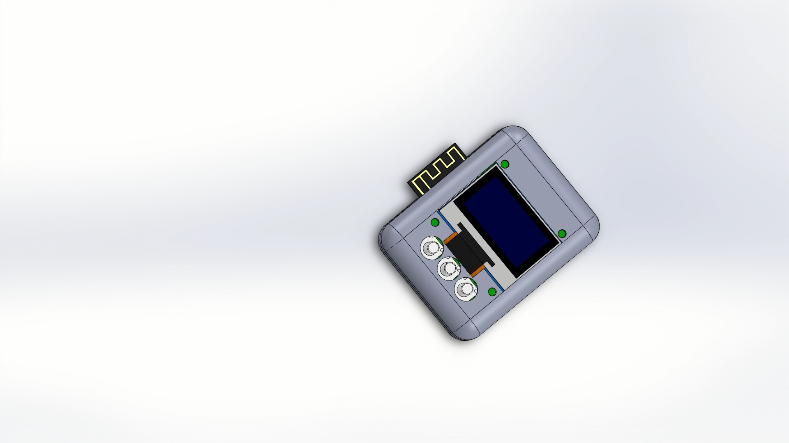
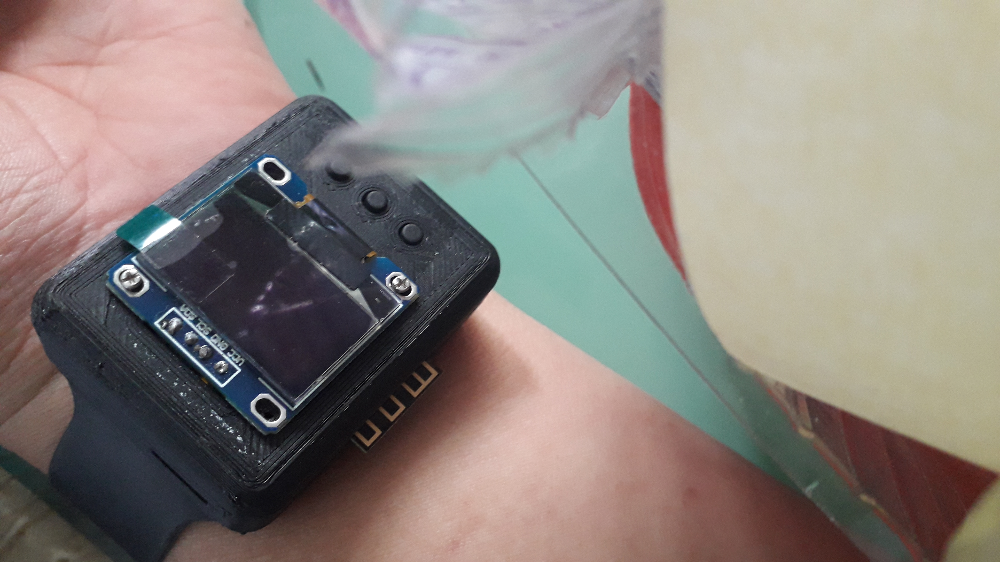

# SMARTWATCH-ESP8266

Version 1.0.0, 04/2022 Author: Huỳnh Đình Sâm

Mạch thiết kế 2 lớp, sử dụng công cụ Altium Designer.
Thiết kế vỏ sản phẩm trên SolidWorks.

# Gia công mạch tại JLCPCB
## Top layer

## Bottom layer

# SẢN PHẨM HOÀN THIỆN

# LAYOUT

The layout of the PCB is available the gerber section. It has been designed to be fabricated on a 1.6mm-thick FR4 2 layer PCB. Depending of your need, it can be fabricated with different thickness.
